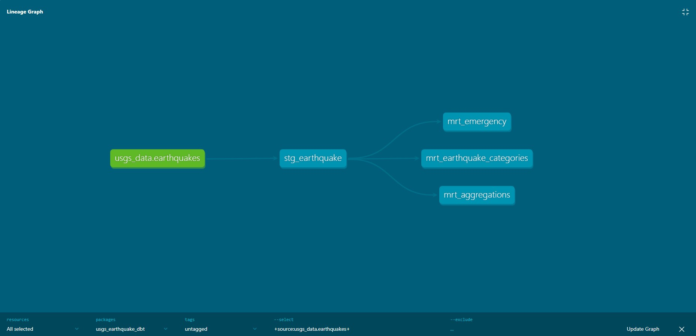
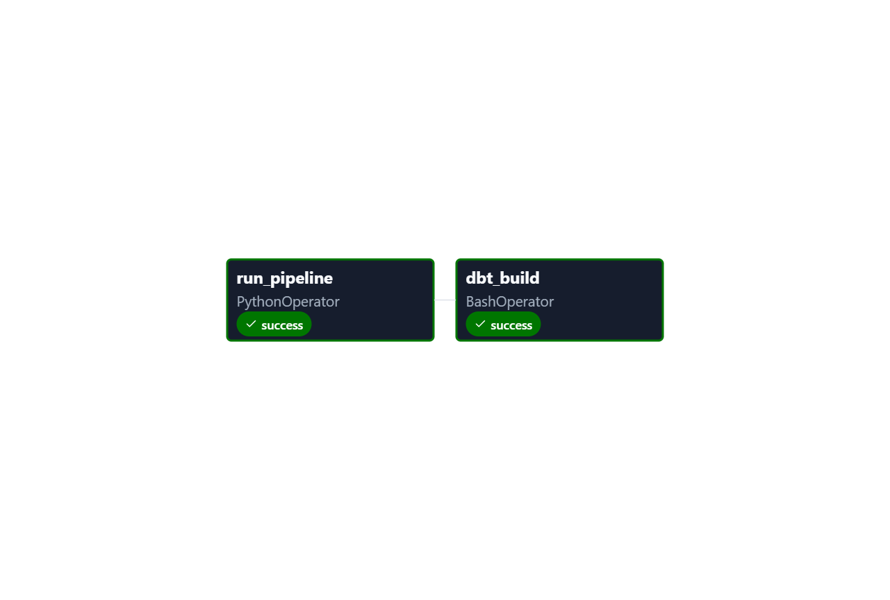
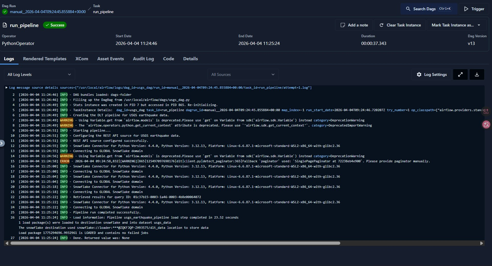
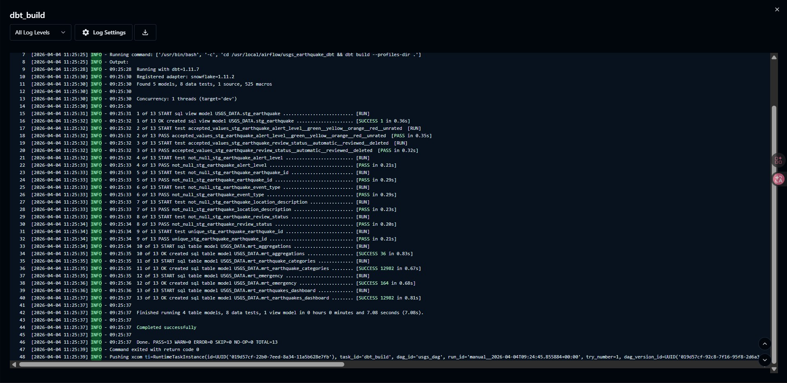
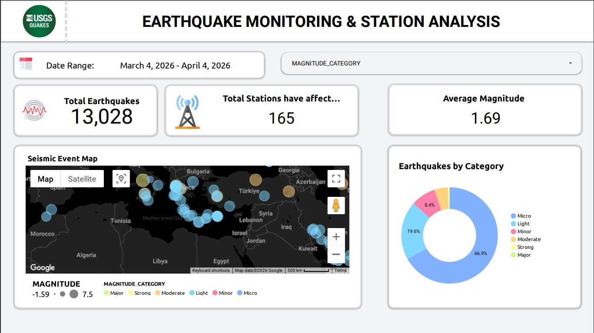
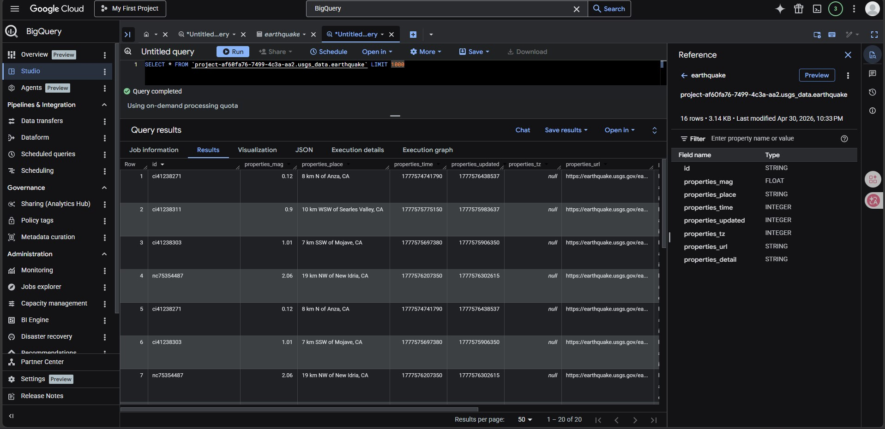

# 🌍 USGS Earthquakes — End-to-End Data Engineering Project

<div align="center">


**A production-grade dual-mode ELT pipeline that ingests live global earthquake data from the USGS API through both a historical batch pipeline (DLT → Snowflake) and a real-time streaming pipeline (Kafka → Spark → BigQuery), transforms it with dbt, and surfaces rich analytics on Looker Studio.**

[📊 View Dashboard](#-dashboard) · [🏗️ Architecture](#️-architecture) · [🚀 Setup & Installation](#-setup--installation)

</div>

---

## 📖 Table of Contents

- [Problem Statement](#-problem-statement)
- [Architecture](#️-architecture)
- [Tech Stack](#-tech-stack)
- [Data Source](#-data-source)
- [Pipeline 1 — Batch (DLT + Airflow + Snowflake + dbt)](#-pipeline-1--batch-dlt--airflow--snowflake--dbt)
- [Pipeline 2 — Stream (Kafka + Spark + BigQuery)](#-pipeline-2--stream-kafka--spark--bigquery)
- [Data Models (dbt Lineage)](#-data-models--dbt-lineage)
- [Orchestration (Airflow DAG)](#️-orchestration--airflow-dag)
- [Dashboard](#-dashboard)
- [Setup & Installation](#-setup--installation)
- [Project Structure](#-project-structure)

---

## 🎯 Problem Statement

> **Who is this for?** Rescue teams, governments, researchers, and residents in earthquake-prone regions who need reliable, up-to-date seismic data to make informed decisions.

Earthquake data is publicly available from the USGS, but it comes as raw GeoJSON — deeply nested, difficult to query, and updated continuously. There is no easy way for analysts to ask questions like:

- 🗺️ *Where do earthquakes cluster geographically?*
- 📉 *Is there a correlation between earthquake depth and magnitude?*
- 🌊 *Which events pose a tsunami risk?*
- ⚠️ *What is the distribution of alert levels (green / yellow / orange / red)?*

This project solves that by building a **dual-pipeline ELT architecture**:

| Mode | Purpose | Destination |
|------|---------|-------------|
| **Batch** | Historical monthly data ingestion + dbt transformations | Snowflake |
| **Streaming** | Real-time per-minute earthquake events | Google BigQuery |

---

## 🏗️ Architecture

The project runs **two independent pipelines** provisioned on GCP infrastructure managed by **Terraform**.

### Batch Pipeline Architecture

```
USGS REST API ──▶ DLT (Python) ──▶ Snowflake (usgs_data) ──▶ dbt build ──▶ Snowflake Marts
      ↑                                                               ↑
   all_month.geojson                                       Orchestrated by Airflow (hourly)
```
<div align="center">
  
</div>
### Streaming Pipeline Architecture
```
USGS REST API ──▶ Kafka Producer (Python) ──▶ Kafka Broker ──▶ PySpark Structured Streaming ──▶ BigQuery
      ↑                                                                                              ↑
   all_hour.geojson (every 60s)                                                          Looker Studio Dashboard
```

### Combined Flow Table

| Stage | Tool | Pipeline | What Happens |
|-------|------|----------|-------------|
| **Infrastructure** | Terraform | Both | Provisions GCS Bucket & BigQuery Dataset on GCP |
| **Batch Ingestion** | DLT (REST API Source) | Batch | Fetches last 30 days of GeoJSON from USGS, loads into Snowflake with `merge` strategy |
| **Stream Ingestion** | Python + Kafka | Stream | Publishes live hourly USGS events every 60 seconds to `earthquake-data` Kafka topic |
| **Stream Processing** | PySpark Structured Streaming | Stream | Consumes Kafka topic, parses & flattens GeoJSON schema, deduplicates, appends to BigQuery |
| **Batch Warehouse** | Snowflake | Batch | Stores raw merged earthquake records in `usgs_data.earthquakes` |
| **Stream Warehouse** | Google BigQuery | Stream | Stores live flattened earthquake records in `usgs_data.earthquake` |
| **Transform** | dbt Core | Batch | Cleans, casts types, categorises magnitudes, alert levels, and generates mart tables |
| **Orchestrate** | Airflow (Astro) | Batch | Schedules `dlt_historical_load → dbt_build` on an hourly cadence |
| **Visualise** | Looker Studio | Both | Interactive dashboard querying dbt BigQuery mart models |

---

## 🛠️ Tech Stack

| Category | Technology |
|----------|-----------|
| **Language** | Python 3.9+ |
| **Infrastructure as Code** | Terraform (GCP provider ~5.0) |
| **Orchestration** | Apache Airflow (via Astronomer Astro CLI) |
| **Batch Ingestion** | DLT (Data Load Tool) — REST API source |
| **Message Broker** | Apache Kafka (KRaft mode, Confluent image 7.8.7) |
| **Stream Processing** | Apache Spark 3.5.3 (PySpark Structured Streaming) |
| **Batch Warehouse** | Snowflake |
| **Stream Warehouse** | Google BigQuery |
| **Data Transformation** | dbt Core (`dbt-snowflake`) |
| **Business Intelligence** | Google Looker Studio |
| **Containerisation** | Docker & Docker Compose |

---

## 📡 Data Source

| Property | Details |
|----------|---------|
| **Provider** | United States Geological Survey (USGS) |
| **Batch Endpoint** | [`all_month.geojson`](https://earthquake.usgs.gov/earthquakes/feed/v1.0/summary/all_month.geojson) — last 30 days |
| **Stream Endpoint** | [`all_hour.geojson`](https://earthquake.usgs.gov/earthquakes/feed/v1.0/summary/all_hour.geojson) — last 60 minutes |
| **Format** | GeoJSON (deeply nested `features` array) |
| **Update Frequency** | Batch: hourly DAG run · Stream: every 60 seconds |
| **License** | Public Domain (USGS) |

---

## 📦 Pipeline 1 — Batch (DLT + Airflow + Snowflake + dbt)

The batch pipeline is responsible for historical and scheduled ingestion of earthquake data into **Snowflake**, followed by **dbt** transformations.

### How It Works

1. **DLT ingestion** (`airflow/include/usgs_pipeline.py`)
   - Uses `dlt`'s `rest_api_source` to call the USGS `all_month.geojson` endpoint.
   - Loads all earthquake `features` into `Snowflake` dataset `usgs_data`, table `earthquakes`.
   - Uses `merge` write disposition keyed on `id` — no duplicates on reruns.

2. **dbt Transformations** (`airflow/usgs_earthquake_dbt/`)
   - Reads from the raw `usgs_data.earthquakes` source in Snowflake.
   - Builds staging views and analytical mart tables (see [Data Models](#-data-models--dbt-lineage)).
   - Targets the `EARTHQUAKE_WH` Snowflake warehouse.

3. **Airflow Orchestration** (`airflow/dags/earthquake_dag.py`)
   - DAG: `earthquake_dag` — runs `@hourly`, no catchup.
   - Task chain: `dlt_historical_load` → `dbt_build`

### Key Files

```
airflow/
├── dags/
│   └── earthquake_dag.py          # DAG definition
├── include/
│   └── usgs_pipeline.py           # DLT pipeline (USGS → Snowflake)
├── usgs_earthquake_dbt/
│   ├── models/
│   │   ├── sources.yml            # Snowflake source declaration
│   │   ├── staging/
│   │   │   └── stg_earthquake.sql # Cleans raw Snowflake data (view)
│   │   └── marts/
│   │       ├── mrt_aggregations.sql
│   │       ├── mrt_earthquake_categories.sql
│   │       ├── mrt_earthquakes_dashboard.sql
│   │       └── mrt_emergency.sql
│   ├── profiles.yml               # Snowflake connection profile
│   └── dbt_project.yml
├── requirements.txt               # dlt, dbt-snowflake, astro-cosmos, etc.
└── Dockerfile                     # Astro runtime image
```

---

## 🌊 Pipeline 2 — Stream (Kafka + Spark + BigQuery)

The streaming pipeline runs continuously, publishing real-time earthquake events from USGS to **Google BigQuery** using Apache Kafka and PySpark Structured Streaming.

### How It Works

1. **Kafka Producer** (`stream/producer.py`)
   - Polls the USGS `all_hour.geojson` endpoint every **60 seconds**.
   - Serialises the full GeoJSON response and publishes it to the `earthquake-data` Kafka topic.
   - Connects to Kafka at `localhost:9092` (configurable via `KAFKA_BOOTSTRAP_SERVERS` env var).

2. **PySpark Consumer** (`stream/spark_consumer.py`)
   - Subscribes to the `earthquake-data` topic from `kafka-stream:29092` (internal Docker network).
   - Defines a strict schema for the USGS GeoJSON `features` array.
   - Explodes the nested array to produce one row per earthquake event.
   - Deduplicates by `id` within each micro-batch.
   - Writes to BigQuery table `{project_id}.usgs_data.earthquake` using the direct write method.
   - Checkpoints to `/tmp/spark-checkpoint/earthquake` for fault tolerance.

3. **Docker Compose Cluster** (`stream/docker-compose.yml`)
   - `kafka-stream`: Confluent Kafka 7.8.7 in KRaft mode (no Zookeeper).
   - `spark-master`: Apache Spark 3.5.3 master node (UI on port `9090`).
   - `spark-worker`: Spark worker node (2 cores, 1 GB RAM).
   - All services share the `confluent` bridge network.

### Key Files

```
stream/
├── docker-compose.yml             # Kafka + Spark cluster definition
├── producer.py                    # USGS → Kafka producer (runs every 60s)
└── spark_consumer.py              # Kafka → PySpark → BigQuery consumer
```

---

## 🔗 Data Models & dbt Lineage

The dbt project transforms raw Snowflake data through two layers — staging (views) and marts (tables):



```
Snowflake: usgs_data.earthquakes (raw)
    │
    ▼
stg_earthquake (VIEW)          ← Cleans types, flattens properties & geometry
    │
    ├──▶ mrt_aggregations (TABLE)             ← Daily KPIs: count, max mag, avg depth, tsunami count
    ├──▶ mrt_earthquake_categories (TABLE)    ← Magnitude category classification
    ├──▶ mrt_emergency (TABLE)               ← Alert-level filtering for emergency response
    └──▶ mrt_earthquakes_dashboard (TABLE)   ← Final joined model powering Looker Studio
```

| Model | Materialization | Description |
|-------|----------------|-------------|
| `stg_earthquake` | View | Casts raw USGS properties: magnitude, location, coordinates, depth, tsunami flag, alert level, review status |
| `mrt_aggregations` | Table | Daily aggregates — total events, max magnitude, average depth, tsunami warnings |
| `mrt_earthquake_categories` | Table | Classifies earthquakes by magnitude range (Minor / Light / Moderate / Strong / Major / Great) |
| `mrt_emergency` | Table | Flags events with active alert levels; provides emergency-level classification |
| `mrt_earthquakes_dashboard` | Table | Dashboard-ready model joining categories and emergency data with coordinates and region |

---

## ✈️ Orchestration & Airflow DAG

The batch pipeline is fully orchestrated by **Airflow** running on **Astronomer (Astro CLI)**. The DAG `earthquake_dag` runs **hourly** and executes two tasks sequentially:



| Task ID | Operator | Description |
|---------|---------|-------------|
| `dlt_historical_load` | `BashOperator` | Runs `usgs_pipeline.py` — fetches monthly USGS data via DLT and merges into Snowflake |
| `dbt_build` | `BashOperator` | Runs `dbt build --profiles-dir .` — rebuilds all staging views and mart tables in Snowflake |

**Execution flow:**
```
[dlt_historical_load] ──▶ [dbt_build]
```

**Pipeline Execution Logs:**




---

## 📊 Dashboard

The dashboard is built in **Google Looker Studio**, connected directly to the `mrt_earthquakes_dashboard` dbt mart table in BigQuery, providing real-time earthquake analytics.

[](USGS-Earthquakes/docs/Earthquake-Dashboard.pdf)

*[📥 Download Full Dashboard PDF](USGS-Earthquakes/docs/Earthquake-Dashboard.pdf)*

**Dashboard panels include:**
- 🗺️ **Global Earthquake Map** — Geographic distribution of events by coordinates
- 📊 **Magnitude Distribution** — Bar chart breakdown by magnitude category
- ⚠️ **Alert Level Tracker** — Proportion of green / yellow / orange / red events
- 🚨 **Emergency Level Summary** — Events flagged for emergency response
- 📅 **Time Series** — Daily earthquake counts and max magnitude trend

---

## 🚀 Setup & Installation

### Prerequisites

| Requirement | Version | Notes |
|------------|---------|-------|
| Python | 3.9+ | For running the producer locally |
| Docker & Docker Compose | Latest | For Kafka + Spark + Airflow |
| Terraform | ≥ 1.0 | For GCP infrastructure provisioning |
| Astronomer CLI (`astro`) | Latest | For Airflow orchestration |
| GCP Service Account | — | BigQuery Admin + Storage Admin roles |
| Snowflake Account | — | Required for batch pipeline destination |

---

### Step 1 — Clone the Repository

```bash
git clone https://github.com/mahmoud-kenawy/DTC-Final-Project.git
cd DTC-Final-Project/USGS-Earthquakes
```

---

### Step 2 — Provision GCP Infrastructure (Terraform)

> This creates the **BigQuery dataset** (`usgs_data`) and **GCS bucket** (`usgs-data-lake-bucket-dtc`) used by the streaming pipeline.

```bash
# Export your GCP service account credentials
export GOOGLE_APPLICATION_CREDENTIALS="/path/to/your/service-account.json"

# Initialise and apply Terraform
cd terraform
terraform init
terraform plan
terraform apply
```

Edit `terraform/variables.tf` to change the `project_id`, `region`, or resource names before applying.

---

### Step 3 — Configure Environment Variables

Copy and populate the `.env` file at the project root:

```bash
# USGS-Earthquakes/.env
GCP_PROJECT_ID=your-gcp-project-id
GCP_BQ_DATASET=usgs_data
KAFKA_BOOTSTRAP_SERVERS=localhost:9092
GOOGLE_APPLICATION_CREDENTIALS=/path/to/gcp-credentials.json
```

Place your GCP service account JSON file at `stream/gcp-credentials.json` for the Spark consumer to use inside Docker.

---

### Step 4 — Run the Batch Pipeline (Airflow + DLT + dbt → Snowflake)

> **This runs the historical data pipeline: USGS → DLT → Snowflake → dbt**

#### 4a. Configure Snowflake Credentials

Update `airflow/usgs_earthquake_dbt/profiles.yml` with your Snowflake account details:

```yaml
usgs_earthquake_dbt:
  target: dev
  outputs:
    dev:
      type: snowflake
      account: <YOUR_SNOWFLAKE_ACCOUNT>     # e.g. ZQKFJQP-ZH93575
      user: <YOUR_USERNAME>
      password: <YOUR_PASSWORD>
      role: ACCOUNTADMIN
      database: DLT_DATA
      schema: USGS_DATA
      warehouse: EARTHQUAKE_WH
      threads: 1
```

Also ensure your DLT Snowflake credentials are in `airflow/.dlt/secrets.toml`:

```toml
[destination.snowflake.credentials]
database = "DLT_DATA"
password = "<YOUR_PASSWORD>"
username = "<YOUR_USERNAME>"
host = "<YOUR_SNOWFLAKE_ACCOUNT>.snowflakecomputing.com"
warehouse = "EARTHQUAKE_WH"
role = "ACCOUNTADMIN"
```

#### 4b. Start Airflow with Astronomer CLI

```bash
cd airflow
astro dev start
```

This spins up 5 Docker containers:
- **Postgres** — Airflow metadata database
- **Scheduler** — Monitors and triggers tasks
- **DAG Processor** — Parses DAG files
- **API Server** — Airflow UI at [http://localhost:8080](http://localhost:8080)
- **Triggerer** — Handles deferred tasks

> Default credentials: **username** `admin` / **password** `admin`

#### 4c. Trigger the DAG

1. Open [http://localhost:8080](http://localhost:8080) in your browser.
2. Enable and trigger the `earthquake_dag` DAG manually, or wait for its hourly schedule.
3. The task chain runs: **`dlt_historical_load`** → **`dbt_build`**

To stop Airflow:
```bash
astro dev stop
```

---

### Step 5 — Run the Streaming Pipeline (Kafka + Spark → BigQuery)

> **This runs the real-time pipeline: USGS → Kafka → PySpark → BigQuery**

#### 5a. Start the Kafka & Spark Cluster

```bash
cd stream
docker-compose up -d
```

This starts:
- **`kafka-stream`** — Kafka broker (KRaft mode) on ports `9092` (external) and `29092` (internal)
- **`spark-master`** — Spark master on port `9090` (UI) and `7077` (submit)
- **`spark-worker`** — Spark worker (2 cores, 1 GB RAM)

Verify services are up:
```bash
docker-compose ps
```

#### 5b. Start the Kafka Producer

In a new terminal, run the Python producer to start publishing earthquake data to Kafka every 60 seconds:

```bash
cd stream
pip install confluent-kafka requests
python producer.py
```

Expected output:
```
Producing data to Kafka...
Data fetched successfully
Data produced to Kafka successfully
```

#### 5c. Start the PySpark Spark Consumer

Run the Spark consumer inside the `spark-master` container to read from Kafka and stream into BigQuery:

```bash
docker exec \
  -e GCP_PROJECT_ID=<your-gcp-project-id> \
  -e KAFKA_BOOTSTRAP_SERVERS=kafka-stream:29092 \
  -d spark-master \
  /opt/spark/bin/spark-submit \
  --packages org.apache.spark:spark-sql-kafka-0-10_2.12:3.5.0,com.google.cloud.spark:spark-bigquery-with-dependencies_2.12:0.32.0 \
  /opt/spark/work-dir/spark_consumer.py
```

> The Spark UI is available at [http://localhost:9090](http://localhost:9090) to monitor the streaming job.

Once Terraform has provisioned GCP, the Kafka producer is publishing events, and the Spark consumer is streaming data into BigQuery, your GCP Console should reflect all provisioned resources and live data:



To stop the streaming cluster:
```bash
docker-compose down
```

---

## 📁 Project Structure

```text
DTC-Final-Project/
└── USGS-Earthquakes/                        # Main project root
    │
    ├── terraform/                           # 🏗️ GCP Infrastructure as Code
    │   ├── main.tf                          #    GCS bucket + BigQuery dataset resources
    │   ├── variables.tf                     #    project_id, region, dataset/bucket names
    │   └── outputs.tf                       #    Output values after apply
    │
    ├── stream/                              # 🌊 Real-Time Streaming Pipeline
    │   ├── docker-compose.yml               #    Kafka (KRaft) + Spark master/worker cluster
    │   ├── producer.py                      #    USGS API → Kafka producer (every 60s)
    │   ├── spark_consumer.py                #    Kafka → PySpark Structured Streaming → BigQuery
    │   └── gcp-credentials.json            #    GCP service account (gitignored)
    │
    ├── airflow/                             # ✈️ Batch Pipeline (Airflow + DLT + dbt)
    │   ├── dags/
    │   │   └── earthquake_dag.py            #    Hourly DAG: dlt_historical_load → dbt_build
    │   ├── include/
    │   │   └── usgs_pipeline.py             #    DLT pipeline: USGS REST API → Snowflake
    │   ├── usgs_earthquake_dbt/             #    dbt project targeting Snowflake
    │   │   ├── models/
    │   │   │   ├── sources.yml              #      Snowflake source declaration
    │   │   │   ├── staging/
    │   │   │   │   └── stg_earthquake.sql   #      Cleans raw records (view)
    │   │   │   └── marts/
    │   │   │       ├── mrt_aggregations.sql          #  Daily KPI aggregates
    │   │   │       ├── mrt_earthquake_categories.sql #  Magnitude classification
    │   │   │       ├── mrt_emergency.sql             #  Emergency alert filter
    │   │   │       └── mrt_earthquakes_dashboard.sql #  Final dashboard model
    │   │   ├── macros/                      #      Custom Jinja macros (e.g. classify_earthquake)
    │   │   ├── profiles.yml                 #      Snowflake connection config
    │   │   └── dbt_project.yml              #      Project config (staging=view, marts=table)
    │   ├── Dockerfile                       #    Astro runtime image
    │   ├── requirements.txt                 #    dlt[snowflake], dbt-snowflake, astro-cosmos
    │   └── airflow_settings.yaml            #    Local connections/variables config
    │
    ├── docs/                                # 📂 Architecture diagrams & screenshots
    │   ├── DTCFinal.drawio .svg             #    Batch pipeline architecture diagram
    │   ├── DTCFinal_Stream.drawio.svg       #    Stream pipeline architecture diagram
    │   ├── dashboard.jpg                    #    Looker Studio dashboard screenshot
    │   ├── Earthquake-Dashboard.pdf         #    Full dashboard PDF export
    │   ├── dbt_lineage.jpg                  #    dbt model lineage graph
    │   ├── data-in-gcp.jpg                  #    GCP Console — provisioned resources
    │   ├── usgs_dag-graph.png               #    Airflow DAG graph view
    │   ├── pipelinetask_log.jpg             #    DLT pipeline task execution log
    │   └── dbttask_log.jpg                  #    dbt build task execution log
    │
    ├── generate_diagram.py                  # 🖼️ Architecture diagram generation script
    └── .env                                 # Environment variables (gitignored)
```

---

## 🤝 Contributing

Pull requests are welcome. For major changes, please open an issue first to discuss what you would like to change.

---

<div align="center">

Made with ❤️ as part of the **Data Engineering Zoomcamp Final Project**

[](https://github.com/mahmoud-kenawy/DTC-Final-Project)

</div>
