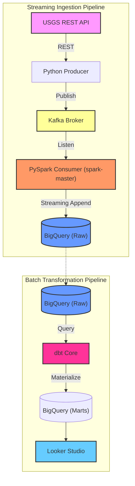

# 🌍 USGS Earthquakes — End-to-End Data Engineering Project

<div align="center">


**An automated, production-grade ELT pipeline that ingests live global earthquake data, streams it through Kafka & Spark, transforms it into analytics-ready models on BigQuery, and surfaces insights in Looker Studio.**

[📊 View Looker Studio Dashboard](#-dashboard) · [🏗️ Architecture](#️-architecture) · [🚀 Quickstart](#-setup--installation)

</div>

---

## 📖 Table of Contents

- [Problem Statement](#-problem-statement)
- [Architecture](#️-architecture)
- [Tech Stack](#-tech-stack)
- [Data Source](#-data-source)
- [Data Models (dbt Lineage)](#-data-models--dbt-lineage)
- [Orchestration (Airflow DAG)](#-orchestration--airflow-dag)
- [Dashboard](#-dashboard)
- [Setup & Installation](#-setup--installation)
- [Running the Pipeline](#-running-the-pipeline)
- [Project Structure](#-project-structure)

---

## 🎯 Problem Statement

> **Who is this for?** Rescue teams, governments, researchers, and residents in earthquake-prone regions who need reliable, up-to-date seismic data to make informed decisions.

Earthquake data is publicly available from the USGS, but it comes as raw GeoJSON — deeply nested, difficult to query, and updated continuously. There is no easy way for analysts to ask questions like:

- 🗺️ *Where do earthquakes cluster geographically?*
- 📉 *Is there a correlation between earthquake depth and magnitude?*
- 🌊 *Which events pose a tsunami risk?*
- ⚠️ *What is the distribution of alert levels (green / yellow / orange / red)?*

This project solves that by building a **robust, automated ELT pipeline** that:

1. **Extracts** live earthquake data from the USGS REST API and publishes it to **Kafka**.
2. **Streams** data through **PySpark (Structured Streaming)** for deduplication and schema flattening.
3. **Loads** the clean stream directly into a **Google BigQuery** data warehouse.
4. **Transforms** the raw data into clean, analytics-ready tables using **dbt**.
5. **Orchestrates** the entire workflow on a schedule using **Apache Airflow**.
6. **Visualises** the results in an interactive **Looker Studio Dashboard**.

---

## 🏗️ Architecture

The project follows a modern **Streaming + ELT** pattern. Infrastructure is provisioned using **Terraform**.

<div align="center">
  
</div>



| Stage | Tool | What happens |
|-------|------|-------------|
| **Infrastructure** | `Terraform` | Provisions GCS and BigQuery on GCP |
| **Ingestion** | `Python + Kafka` | Fetches GeoJSON from USGS API, pushes to a Kafka topic |
| **Streaming & Load** | `PySpark` | Structured Streaming job consumes Kafka, flattens JSON arrays, writes to BigQuery using the `spark-bigquery-connector` |
| **Warehouse** | `Google BigQuery` | Cloud data warehouse — stores raw and transformed data |
| **Transform** | `dbt` | Cleans, casts types, categorises magnitudes and alert fields |
| **Orchestrate** | `Airflow` | Schedules the python producer, spark submit, and dbt build |
| **Visualise** | `Looker Studio` | Interactive reporting layer dynamically querying BigQuery marts |

---

## 🛠️ Tech Stack

- **Cloud**: Google Cloud Platform (GCP)
- **Infrastructure as Code (IaC)**: Terraform
- **Orchestration**: Apache Airflow
- **Message Broker**: Apache Kafka
- **Stream Processing**: Apache Spark (PySpark)
- **Data Warehouse**: Google BigQuery
- **Data Transformation**: dbt (Data Build Tool)
- **Business Intelligence**: Looker Studio

---

## 📡 Data Source

| Property | Details |
|----------|---------|
| **Provider** | United States Geological Survey (USGS) |
| **Endpoint** | [USGS Earthquakes Feed](https://earthquake.usgs.gov/earthquakes/feed/v1.0/summary/all_hour.geojson) |
| **Format** | GeoJSON (nested) |
| **Update frequency** | Live / Continuous |

---

## 🔗 Data Models & dbt Lineage

The dbt project transforms raw data through three layers, adapting the schema explicitly for BigQuery:


```
usgs_data.earthquake ──▶ stg_earthquake ──┬──▶ mrt_emergency
                                          ├──▶ mrt_earthquake_categories
                                          └──▶ mrt_aggregations
```

| Model | Type | Description |
|-------|------|-------------|
| `stg_earthquake` | View | Cleans raw JSON properties |
| `mrt_emergency` | Table | Filters events by alert level; used for emergency reporting |
| `mrt_earthquake_categories` | Table | Categorises earthquakes by magnitude range |
| `mrt_aggregations` | Table | Time-based and geo-based aggregate statistics for KPIs |

---

## ✈️ Orchestration & Airflow DAG

The pipeline is orchestrated by Apache Airflow. The DAG `earthquake_dag` handles the following flow sequentially:


1. `fetch_usgs_data` (`BashOperator`): Triggers a Python batch producer to fetch the latest hour's GeoJSON and write to the local Kafka broker.
2. `consume_kafka_spark` (`BashOperator` / `SparkSubmitOperator`): Triggers a Spark Structured Streaming batch to consume the latest messages, explode the layout, and append cleanly into BigQuery.
3. `dbt_build` (`BashOperator`): Triggers the transformations to recreate upstream mart tables.

*Note: You can also run the streaming pipeline continuously outside of Airflow using the `stream/` Docker setup.*

---

## 📊 Dashboard

The dashboard is built natively using **Google Looker Studio**, directly hooked into our heavily analytical dbt BigQuery models.

[](USGS-Earthquakes/docs/Earthquake-Dashboard.pdf)
*[View Full Earthquake Dashboard PDF](USGS-Earthquakes/docs/Earthquake-Dashboard.pdf)*

- 🗺️ **Global Map**
- 📊 **Magnitude Distribution**
- ⚠️ **Alert Level Tracking**

---

## 🚀 Setup & Installation

### Prerequisites

- **Python 3.9+**
- **Docker Compose**
- **Terraform**
- **Google Cloud Service Account** with BigQuery Admin / Storage Admin access.

### Step 1: Clone the Repo

```bash
git clone https://github.com/mahmoud-kenawy/DTC-Final-Project.git
cd DTC-Final-Project/USGS-Earthquakes
```

### Step 2: Infrastructure as Code (GCP Setup)

Ensure your `GOOGLE_APPLICATION_CREDENTIALS` environment variable points to your service account key.

```bash
cd terraform
terraform init
terraform plan
terraform apply
```
This will automatically generate your `usgs_data` dataset.


### Step 3: Start Kafka and Docker Services

You should start the local infrastructure using docker-compose.
```bash
docker-compose up -d
```
*(This ensures your Local Kafka server is running on `host.docker.internal:9092`)*

### Step 4: Configure Airflow and dbt
Make sure you update the dbt profiles to target BigQuery securely instead of Snowflake, using robust `oauth` or service account credentials.

---

## 🏃 Running the Pipeline

To run the real-time streaming pipeline locally, we use the provided Docker Compose environment to avoid any local OS dependencies (like Hadoop/winutils on Windows):

```bash
# 1. Start the Kafka and Spark cluster
cd stream
docker-compose up -d

# 2. Start the Python producer to push live data to Kafka
python producer.py

# 3. Launch the PySpark Consumer inside the Spark container to write to BigQuery
# (Ensure GOOGLE_APPLICATION_CREDENTIALS is mapped or authenticated inside the container)
docker exec -e GCP_PROJECT_ID=<your-project-id> -e KAFKA_BOOTSTRAP_SERVERS=kafka-stream:29092 -d spark-master /opt/spark/bin/spark-submit --packages org.apache.spark:spark-sql-kafka-0-10_2.12:3.5.0,com.google.cloud.spark:spark-bigquery-with-dependencies_2.12:0.32.0 /opt/spark/work-dir/spark_consumer.py

# 4. Transform Data
cd ../airflow/usgs_earthquake_dbt
dbt build --profiles-dir .
```

**Pipeline Execution Logs:**


---

## 📁 Project Structure

```text
USGS-Earthquakes/
├── terraform/                   # GCP IaC
│   ├── main.tf
│   ├── variables.tf
│   └── outputs.tf
├── stream/                      # Dockerized Streaming Pipeline
│   ├── docker-compose.yml       # Kafka & Spark cluster
│   ├── producer.py              # Fetches USGS Data
│   └── spark_consumer.py        # Kafka -> PySpark -> BigQuery
├── airflow/
│   ├── dags/
│   │   └── earthquake_dag.py    # Airflow orchestration
│   └── usgs_earthquake_dbt/     # dbt transformations
└── README.md
```

<div align="center">
Made with ❤️ as part of the Data Engineering Zoomcamp Final Project
</div>
