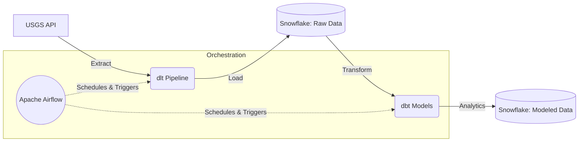

# 🌍 USGS Earthquakes Data Engineering Project


An end-to-end Data Engineering (ELT) pipeline that extracts global earthquake data from the USGS (United States Geological Survey) REST API, loads it into Snowflake using **dlt**, transforms the raw JSON data into analytics-ready models using **dbt**, and orchestrates the entire workflow utilizing **Apache Airflow** (deployed via Astronomer).

---

## 🏗️ Architecture & Project Structure

The project follows a standard ELT (Extract, Load, Transform) architecture:



### Directory Layout
- **`.` (Root)**: Contains the `dlt` ingestion script (`usgs_pipeline.py`) which connects to the USGS REST API and loads data into Snowflake.
- **`airflow/`**: Dedicated Apache Airflow environment generated via Astronomer Astro CLI (`astro dev init`). It contains the DAGs for pipeline orchestration.
- **`usgs_earthquake_dbt/`**: The dbt project that connects to Snowflake to clean, flatten, and model the raw ingested JSON data into structured tables/views.

---

## 📊 Data Source

- **API Endpoint**: [USGS Earthquakes Feed](https://earthquake.usgs.gov/earthquakes/feed/v1.0/summary/all_month.geojson)
- **Data Scope**: All recorded global earthquakes from the past month.
- **Format**: GeoJSON
- **Update Frequency**: Live / Continuous

---

## 🚀 Setup & Installation

### 1. Prerequisites
- Python 3.9+
- [Docker & Docker Compose](https://docs.docker.com/get-docker/) (for running Airflow locally)
- [Astro CLI](https://docs.astronomer.io/astro/cli/install-cli) (Astronomer)
- A [Snowflake](https://www.snowflake.com/) account and data warehouse.

### 2. Environment Configuration

#### dlt Credentials
Create a `.dlt/secrets.toml` file in the project root to configure your Snowflake ingestion credentials:
```toml
[destination.snowflake.credentials]
database = "YOUR_DATABASE"
password = "YOUR_PASSWORD"
username = "YOUR_USERNAME"
host = "YOUR_ACCOUNT.snowflakecomputing.com"
warehouse = "YOUR_WAREHOUSE"
role = "YOUR_ROLE"
```

#### dbt Profile
Ensure your `~/.dbt/profiles.yml` is configured to point to the same Snowflake database and schema (`usgs_data`) to allow dbt to transform the loaded tables.

#### Airflow Connections
When Airflow is running, configure the necessary Snowflake and dbt connections internally within the Airflow UI or via `airflow/airflow_settings.yaml`.

---

## 🏃 Running the Pipeline

### Option A: Manual Execution
1. Install Python dependencies:
   ```bash
   pip install -r requirements.txt
   ```
2. Run the ingestion pipeline (`dlt`):
   ```bash
   python usgs_pipeline.py
   ```
3. Run the transformations (`dbt`):
   ```bash
   cd usgs_earthquake_dbt
   dbt run
   dbt test
   ```

### Option B: Orchestrated via Airflow (Astronomer)
1. Navigate to the airflow directory:
   ```bash
   cd airflow
   ```
2. Start the local Airflow environment using Astro CLI:
   ```bash
   astro dev start
   ```
3. Access the Airflow UI at `http://localhost:8080/` (default credentials: `admin`/`admin`).
4. Trigger the equivalent USGS pipeline DAG to run the end-to-end extraction, loading, and transformation workflow automatically.

---

## 🛠️ Pipeline Details

### 1. Extraction & Loading (`dlt`)
- Uses the `rest_api_source` to fetch features from the USGS API.
- Flattens nested JSON structures (`max_table_nesting = 0`) to prevent overly complex array columns.
- Uses a `merge` write disposition based on the earthquake `id` to efficiently upsert new data and prevent duplicates.
- Target Table: `usgs_data.earthquakes` in Snowflake.

### 2. Transformation (`dbt`)
- Connects to the raw `usgs_data` schema.
- Cleans and casts timestamps, extracts geo-coordinates (longitude, latitude, depth), and standardizes magnitude fields.
- Creates models suitable for BI tools and downstream analytics.

### 3. Orchestration (`Airflow`)
- Schedules the DAGs using Astronomer's runtime.
- Employs TaskFlow API for dependency management between the `dlt` ingestion and `dbt` transformation steps.
